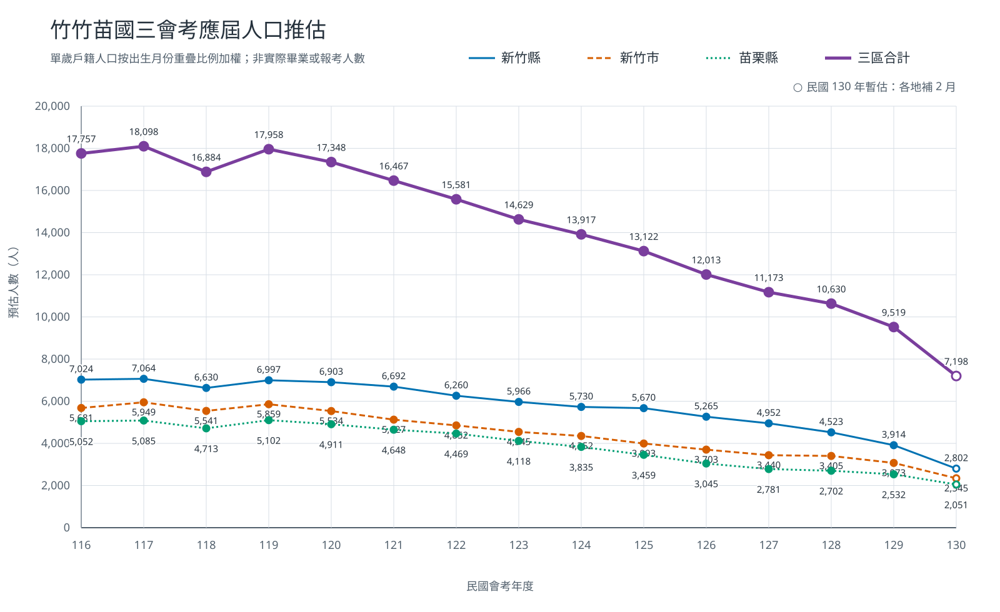

# 新竹苗栗人口典藏與學齡分析

這個專案每月從新竹縣、新竹市及苗栗縣官方網站取得單歲戶籍人口與
戶籍動態資料，保存不可變原始檔及 SQLite 時序資料，並輸出：

- 民國 116–130 年國三會考戶籍人口 cohort 推估。
- 年度戶籍遷入、遷出登記總數與登記淨變化。
- 幼幼班至國中二年級，同一出生 cohort 相隔 12 個月的人口變化。

結果不是實際在學或報考人數。戶籍遷入／遷出登記總數包含縣市內跨
行政區移動，不代表跨縣市移入人口。

## 會考應屆人口推估



圖中數值是依戶籍單歲人口推估的 cohort 人數，不是實際畢業生或會考
報考人數。民國 130 年因三地各補足兩個月份，標示為暫估。

資料表：[民國 116–130 年會考人口推估](data/population/exports/20260729T145221.972744Z/exam_population_116_130.csv)

重新產圖：

```bash
python3 scripts/render_exam_population_chart.py
```

## 官方來源

- 新竹縣政府民政處：
  <https://civil.hsinchu.gov.tw/cl.aspx?n=1224>
- 新竹市單歲人口：
  <https://dep-civil.hccg.gov.tw/ch/home.jsp?id=58&parentpath=0,4,46>
- 新竹市戶籍動態：
  <https://dep-civil.hccg.gov.tw/ch/home.jsp?id=56&parentpath=0,4,46>
- 苗栗縣戶政服務網年度下載頁：
  `https://mlhr.miaoli.gov.tw/xlsgetfile_<民國年>.php`

## 執行

不需要第三方 Python 套件。

```bash
python3 scripts/estimate_exam_population.py update
python3 scripts/estimate_exam_population.py analyze
python3 scripts/estimate_exam_population.py gaps
```

預設從民國 `114-01` 回補，資料保存在 `data/population/`。可指定其他
位置或範圍：

```bash
python3 scripts/estimate_exam_population.py update \
  --data-root /absolute/path/to/population-data \
  --backfill-from 114-01 \
  --start-year 116 \
  --end-year 130
```

每次 `update` 仍會讀取三個官方索引頁以發現新月份，但只下載 SQLite
尚未記錄的完整附件 URL。已成功解析或已標記為 PDF 的附件不重抓；
曾解析失敗的附件直接從本機 raw 重新解析。此策略無法偵測官方用完全
相同 URL 覆蓋檔案內容。

若任一地區／資料集的最新可解析候選下載或解析失敗，`update` 會回傳
exit code 1、保留已取得的原始檔與診斷，但不建立新的 exports 目錄。
歷史 PDF 會保存為 `unsupported_media`，不使用 OCR，也不補零。

## 測試

```bash
python3 -m unittest discover -s tests -p 'test_*.py' -v
```

## 授權

本專案採用 [MIT License](LICENSE)，Copyright (c) 2026 Vincent Chou。
官方原始人口資料的權利與來源仍歸各發布機關所有。
